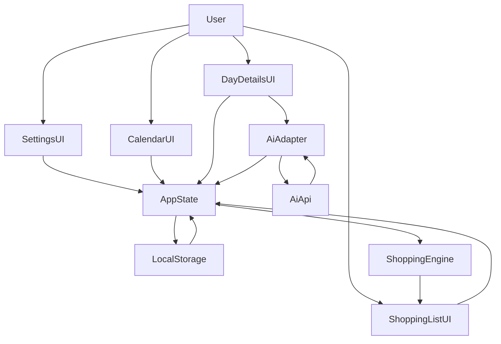

## Meal Planner Weekend MVP

### Goals

- **Themed weekly framework**: Let the user define recurring themes per weekday (e.g., "Taco Tuesday") and show them in a weekly calendar.
- **Calendar-based planning**: Display a simple but modern weekly view where each day can hold a single chosen recipe tied to its theme.
- **AI recipe suggestions**: For a selected day + theme, call an AI API to generate ~3 recipe options, allow the user to pick one or reroll.
- **Portion scaling**: Treat recipes as base servings and scale quantities to the user’s household size (e.g., 4 servings) and any per-day overrides.
- **Shopping list export**: Given 1–7 selected days, aggregate ingredients across recipes (summing quantities by ingredient+unit) and show a readable, printable list.
- **Local-only persistence**: Store themes, settings, and current week’s selections in `localStorage` so the prototype works as a browser app (and still runs via Electron if you want).

### High-level architecture

- **Frontend-only web app**
  - Keep the existing shell in `[index.html](index.html)`, `[styles.css](styles.css)`, and adapt `[renderer.js](renderer.js)` into the main SPA logic (no framework overhead for the weekend).
  - Electron files (`[electron-main.js](electron-main.js)`, `[preload.js](preload.js)`) remain but are not required for browser use; they simply allow running the same UI as a desktop shell.
- **State management**
  - Use in-memory JS objects for current settings, current week plan, and UI selection state (selected day, selected recipes, selected days for shopping list).
  - Mirror state into `localStorage` on change and hydrate on load.
- **AI integration**
  - Add a small AI adapter module (either as functions inside `[renderer.js](renderer.js)` or a separate script file like `[ai-adapter.js](ai-adapter.js)` loaded from `index.html`) that:
    - Reads an API key and model choice from user-configured settings (stored locally, never committed).
    - Sends a `fetch` request to a configurable OpenAI-compatible chat/completions endpoint.
    - Expects structured JSON describing 3 candidate recipes and maps them into the app’s `Recipe` shape.
- **Shopping list engine**
  - Implement pure functions in JS to:
    - Collect recipes for the selected days.
    - Normalize ingredient keys (name + unit) and aggregate quantities.
    - Return a list that the UI renders as text and optionally as a copy/print-friendly block.

### Data model

- **Core types (conceptual, implemented as JS objects)**
  - `**ThemeConfig`**: mapping from weekday key to theme label.
    - Example: `{ Mon: 'Meatless Monday', Tue: 'Taco Tuesday', ... }`.
  - `**Settings`**:
    - `householdSize: number` (e.g., 4).
    - `defaultWeekStart: 'Mon' | 'Sun'` (for calendar display, default `'Mon'`).
    - `themes: ThemeConfig`.
    - `ai: { apiKey?: string; model: string; baseUrl: string }`.
  - `**Ingredient**`:
    - `name: string` (e.g., `"chicken breast"`).
    - `quantity: number` (per base recipe servings).
    - `unit: string` (e.g., `"g"`, `"tbsp"`).
    - Optional `category?: string` for future grouping ("Produce", "Pantry", etc.).
  - `**Recipe**`:
    - `id: string` (unique per recipe suggestion).
    - `title: string`.
    - `theme: string` (copied from the day’s theme where relevant).
    - `baseServings: number` (e.g., 2 or 4 as returned by AI).
    - `ingredients: Ingredient[]`.
    - `steps: string[]` (simple step-by-step text instructions).
  - `**PlannedDay**`:
    - `dateISO: string` (e.g., start-of-day ISO for that week’s date).
    - `weekday: 'Mon' | 'Tue' | ...`.
    - `theme: string`.
    - `selectedRecipeId?: string`.
    - `servingsOverride?: number` (if user wants that day to be different from household default).
  - `**WeekPlan**`:
    - `weekStartISO: string` (Monday or Sunday of the displayed week).
    - `days: PlannedDay[]` (always 7 entries).

### UI & interaction design

- **Initial setup / settings panel**
  - Add a simple settings area (either a modal or a side panel) accessible via a button in the header of `[index.html](index.html)`.
  - Fields:
    - Household size (integer input, default 4).
    - Theme for each weekday (text inputs with hints like "Taco Tuesday", "Pasta Night").
    - AI settings: API key text field (stored only in `localStorage`), optional model name, and base URL.
  - On save:
    - Persist `Settings` to `localStorage`.
    - Re-render the weekly calendar using themes and household size.
- **Weekly calendar view**
  - Reuse the existing grid in `[index.html](index.html)` and `[styles.css](styles.css)` but change the content:
    - Each day-card shows: weekday label, actual calendar date, theme name, and either the selected recipe title or a placeholder like "No recipe selected".
    - Add a subtle indicator if the day is part of the current shopping-list selection (e.g., a small checkmark or pill).
- **Day details panel**
  - In the right-hand `Selected Day` panel:
    - If no day is selected: keep a friendly empty state.
    - If a day is selected:
      - Show its theme, date, and current recipe (if any).
      - Show a button like **"Generate 3 AI recipes"** when there is no recipe yet (or a "Reroll suggestions" button).
      - Display the three AI suggestions as cards with title, brief description (optional), and core ingredients; allow user to click one to select it for the day.
      - Once a recipe is selected:
        - Show list of ingredients with **scaled quantities** according to `effectiveServings = servingsOverride || householdSize`.
        - Allow the user to tweak servings for that day (small increment/decrement or numeric input) and recompute scaled quantities as `scaledQty = ingredient.quantity * (effectiveServings / baseServings)`.
        - Show simple step-by-step instructions.
- **Shopping list selection & export**
  - Add a shopping-bar element above or below the weekly grid:
    - Text: "Select 1–7 days, then generate a shopping list".
    - A toggle/checkbox per day (or clicking on the day-card toggles `selectedForShopping` with a subtle UI marker).
    - A button **"Generate shopping list"** that becomes enabled when at least 1 and at most 7 days are selected.
  - When clicked:
    - Collect all `PlannedDay` entries with `selectedRecipeId` and in the selected set.
    - Create an aggregated list of ingredients.
    - Render the result in a dedicated panel or modal:
      - Grouped by ingredient name+unit.
      - Show total quantity and unit.
      - Optionally, group items by category if recipes provide it (future-friendly, but we can start flat).
      - Provide a large read-only `<textarea>` or styled list with **Copy** and **Print** buttons.

### AI recipe generation design

- **Prompt and response format**
  - Define a fixed JSON response format for the AI to follow, e.g.:
    - `[{ id, title, baseServings, ingredients: [{ name, quantity, unit }], steps: [ ... ] }, ...]` for 3 items.
  - In the AI adapter, construct a prompt containing:
    - Day of week and theme (e.g., "Tuesday • Taco Tuesday").
    - Household size to target for `baseServings`.
    - Any constraints you want (simple, family-friendly, avoid super obscure ingredients, etc.).
- **Adapter implementation (in `[ai-adapter.js](ai-adapter.js)` or inside `[renderer.js](renderer.js))**
  - Read stored API key and model from `Settings.ai`.
  - If the key is missing, show a helpful error message in the UI and skip the call.
  - Use `fetch` with `Authorization: Bearer <apiKey>` to call the AI endpoint.
  - Parse the returned content as JSON (with defensive error handling and fallback messaging if parsing fails).
  - Normalize the recipes into `Recipe` objects and return them to the caller.
- **UI integration**
  - In the day-details panel, wire **Generate 3 AI recipes** to call the adapter and store the resulting recipes in in-memory state.
  - Support a **Reroll** button that re-invokes the adapter (with the same theme/day).
  - Once the user clicks a recipe card, set `selectedRecipeId` on that `PlannedDay` and clear the suggestions list.

### Shopping list aggregation logic

- **Scaling per recipe**
  - For each `PlannedDay` being included:
    - Determine `effectiveServings` based on `servingsOverride` or `Settings.householdSize`.
    - For each ingredient in the chosen recipe, compute `scaledQty = ingredient.quantity * (effectiveServings / recipe.baseServings)`.
- **Aggregation across days**
  - Use a map keyed by `ingredientKey = normalizeName(name) + '|' + unit`.
    - `normalizeName` can be a simple lowercase trim function for now.
  - Add `scaledQty` into that key’s running total.
  - Produce an array like `{ name, totalQuantity, unit }[]` for rendering.
- **Output format**
  - Present the shopping list as a human-readable block, for example:
    - `1.2 kg chicken breast`\n`6 pcs tortillas`\n`3 tbsp olive oil`...
  - Optionally, break into categories if `category` is present, with category headings and bullet lists beneath.

### Persistence strategy

- **LocalStorage keys**
  - `mealPlanner.settings` → serialized `Settings` object.
  - `mealPlanner.weekPlan.<weekStartISO>` → serialized `WeekPlan` for each week (so you can revisit older weeks later if desired).
- **Hydration on load**
  - On `DOMContentLoaded` (in `[renderer.js](renderer.js)`):
    - Load `Settings` if present; otherwise, create defaults and prompt the user to configure themes/household size.
    - Derive current week’s `weekStartISO` based on `defaultWeekStart` and today’s date.
    - Load or initialize `WeekPlan` for that `weekStartISO`.
    - Render the calendar and selected-day panel using this state.

### Implementation steps (high level)

- **1. Refine layout and scaffolding**
  - Update `[index.html](index.html)` to include:
    - A settings button and modal/panel markup.
    - A shopping list toolbar and modal/panel container.
  - Keep `styles.css` largely as-is, adding minimal classes for new controls.
- **2. Introduce structured state in `renderer.js`**
  - Replace the current `MOCK_PLAN` approach with:
    - In-memory `settings`, `currentWeekPlan`, `uiState` (selected day index, days selected for shopping list, current AI suggestions, loading/error states).
  - Implement helper functions for:
    - Calculating `weekStartISO` and generating the 7-day structure.
    - Loading/saving settings and week plans from/to `localStorage`.
- **3. Implement calendar rendering and day selection**
  - Rework `renderWeekGrid` to use `currentWeekPlan` + `settings.themes` and show selected recipe titles.
  - Update `selectDay` to:
    - Track the selected index.
    - Render the selected day’s details including theme, recipe info, and actions.
- **4. Build the settings UI and wiring**
  - Create handlers to open/close the settings panel.
  - On save, validate inputs and update `settings` and `currentWeekPlan` themes.
  - Persist to `localStorage` and re-render the calendar.
- **5. Add AI adapter functions and integrate**
  - Implement an AI client (either inline or in a small new script file) that:
    - Reads API key/model from `settings`.
    - Calls the chosen AI endpoint.
    - Returns normalized `Recipe[]`.
  - Wire the **Generate 3 AI recipes** button to this client and display suggestions in the day details.
  - Support selecting a recipe and persisting it into `currentWeekPlan` and `localStorage`.
- **6. Implement portion scaling in the day view**
  - Add UI controls to adjust servings for the selected day.
  - Compute and display scaled ingredient quantities and total servings.
- **7. Implement shopping list selection and export**
  - Add per-day selection toggles and a global **Generate shopping list** button.
  - Write aggregation logic and render the final list in a modal/panel with copy/print options.
- **8. Polish and validation**
  - Add basic error and loading states for AI calls.
  - Ensure behavior remains acceptable both in a browser (opening `index.html`) and when run via `npm start` under Electron.

### Architecture/data-flow diagram

